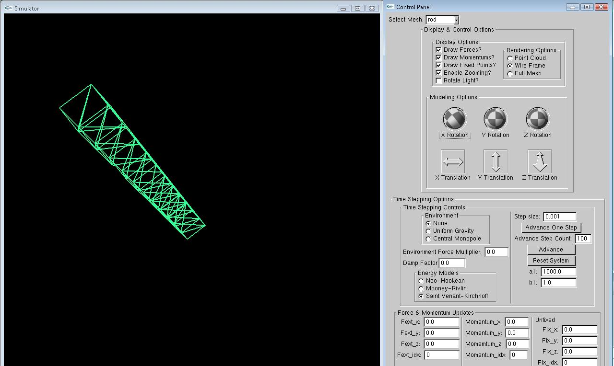

# Introduction

This repository hosts C++ code that implements one type of variational integrators for physical simulation. The implemented variational integrator is based on the Hamilton-Pontryagin Principle. Resulting integrator have exact momentum preservation and correct energy behavior. Furthermore, external 
forces and holonomic constraints can be easily applied to the system.

The major component of this project is the proposed numerical integrator and a GUI (like below) that allows the user to control most of the variables (step size, material property etc) in the simulation.

